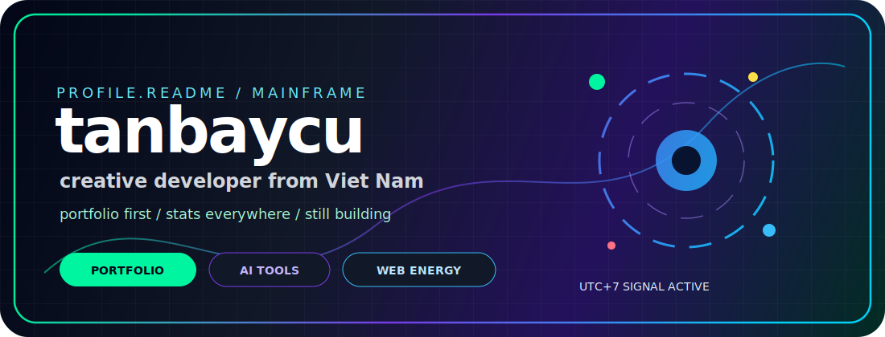

<div align="center">



<br />

<a href="https://tanbaycu.is-a.dev">
  
</a>

<br />
<br />


<br />

<a href="https://tanbaycu.is-a.dev"></a>
<a href="https://github.com/tanbaycu"></a>
<a href="https://linktr.ee/tanbaycu"></a>


</div>

---

<div align="center">

## signal

```txt
identity     tanbaycu / tmt
base         Viet Nam, UTC+7
mode         build quietly, ship loudly
focus        portfolio, web craft, ai tools, automation
status       still building
```

</div>

---

<div align="center">

## tech constellation


</div>

---

<div align="center">

## github command center


</div>

---

<div align="center">

## deep stats


</div>

---

<div align="center">


<br />

**enter the portfolio. read the stats. watch the build continue.**

<br />
<br />

<a href="https://tanbaycu.is-a.dev">
  
</a>

</div>
